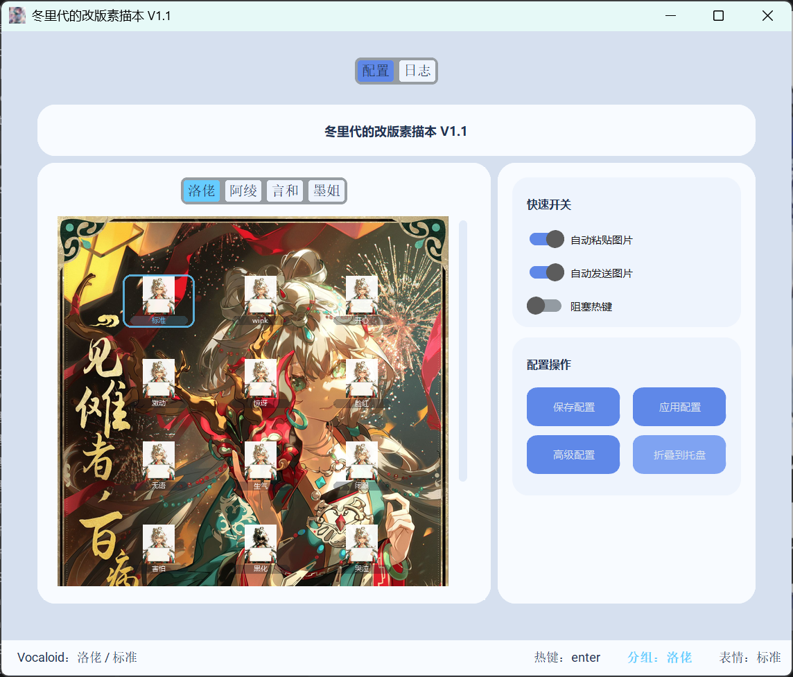
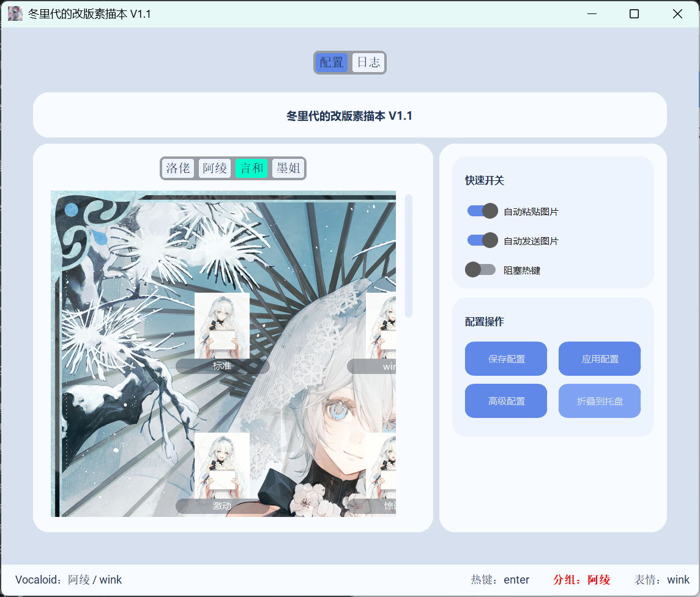
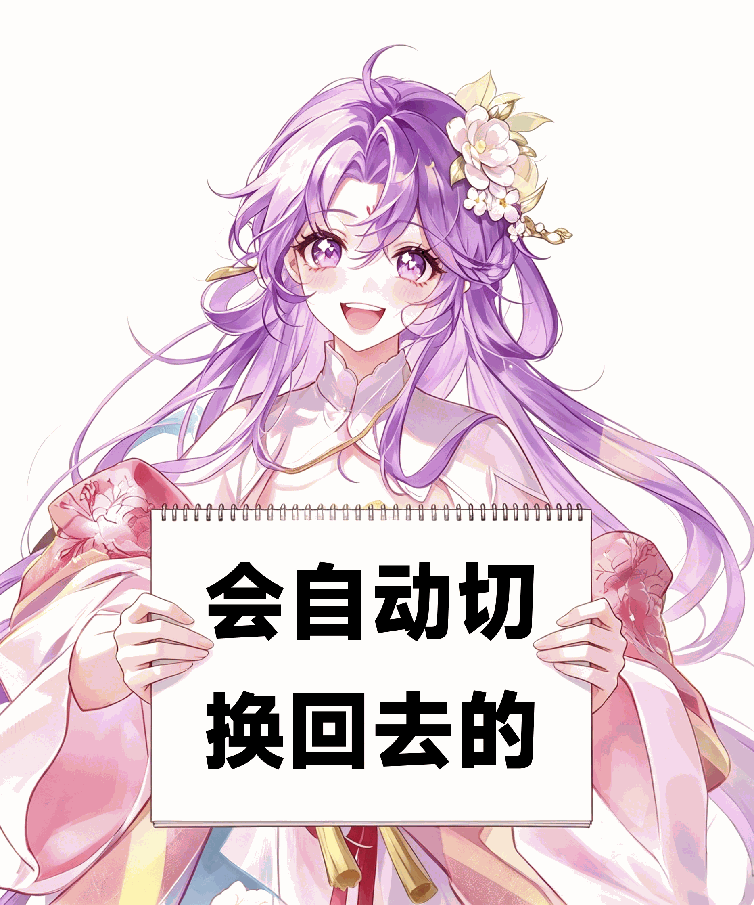
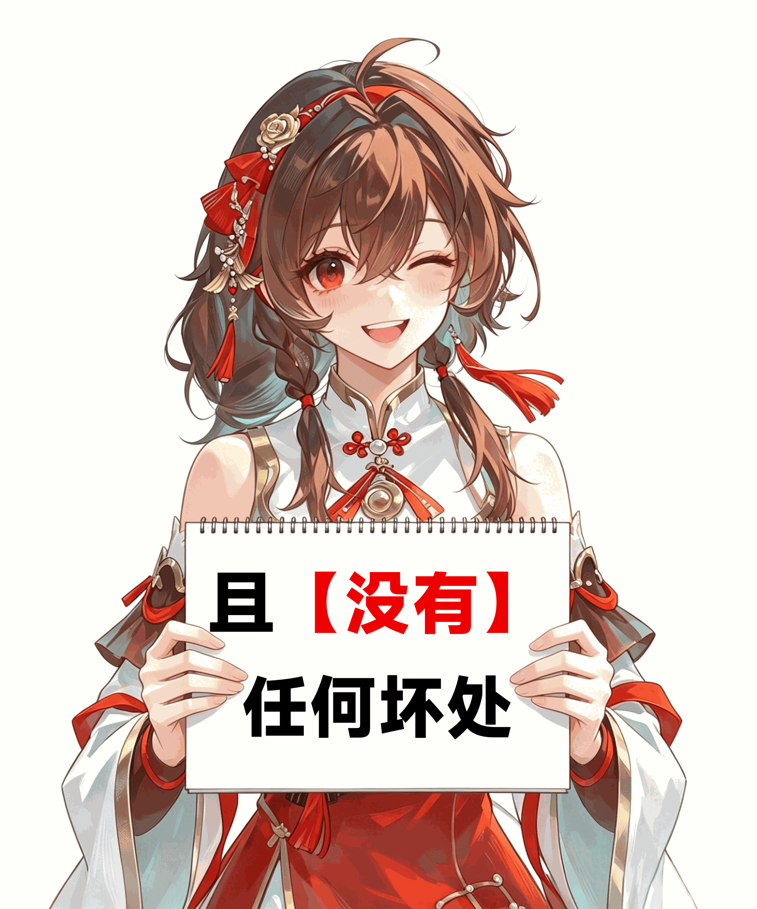
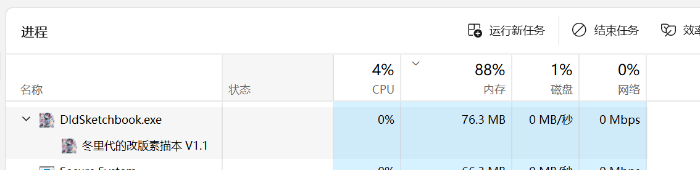

# 🎨 冬里代の改版素描本

[](https://www.python.org/)
[](https://www.microsoft.com/windows)
[](LICENSE)

> 一键生成角色表情对话框，自动粘贴发送至 QQ / 微信。无需安装 Python 或任何运行环境。



***

## ⚡ 一句话概述

选中一个角色和表情，按下热键，程序自动将当前输入框的内容渲染到角色底图上，生成 GIF 并粘贴发送。四角色、13 种表情、零手动操作。

***

## 🚀 快速开始

### 方式一：直接运行（推荐，无需安装 Python）

从 [Releases](https://github.com/ad1454-1/Dld-s-Sketchbook-v1.0.0/releases) 下载 `DldSketchbook.zip`，解压后：

1. 右键 `DldSketchbook.exe` → （推荐）**以管理员身份运行**
2. 首次切换会自动渲染全部场景，看到这种样式时，请稍等片刻：



1. 加载完成后会自动恢复正常，之后切页签秒开：



### 方式二：源码运行

```bash
git clone https://github.com/ad1454-1/Dld-s-Sketchbook-v1.0.0.git
cd Dld-s-Sketchbook-v1.0.0
pip install -r requirements.txt
python main.py
```

***

## 🎭 角色图库

内置 4 个 Vocaloid 角色，每个角色 13 种表情，带独立海报与应援色：

| 角色 | 表情数 | 应援色       |
| -- | --- | --------- |
| 洛佬 | 13  | `#66ccff` |
| 阿绫 | 13  | `#ee0000` |
| 言和 | 13  | `#00ffcc` |
| 墨姐 | 13  | `#ffff00` |


- **切页签**：点击顶部角色名，海报与表情按钮即时切换
- **切表情**：点击卡片按钮切换当前选中表情，蒙版和文字实时刷新



***

## ⚙️ 配置说明

程序首次运行会自动使用默认配置，无需手动创建配置文件。如需调整参数，可通过 UI 侧边栏「高级配置」实时修改，所有变更自动保存到 `config.yaml`。

| 配置                  | 默认值                    | 说明          |
| ------------------- | ---------------------- | ----------- |
| `hotkey`            | `enter`                | 触发图片生成的主热键  |
| `allowed_processes` | `qq.exe`, `weixin.exe` | 热键仅在这些进程中生效 |
| `paste_hotkey`      | `ctrl+v`               | 粘贴快捷键       |
| `send_hotkey`       | `enter`                | 发送快捷键       |
| `auto_paste_image`  | `true`                 | 生成后自动粘贴     |
| `auto_send_image`   | `true`                 | 粘贴后自动发送     |
| `font_file`         | `Fonts/font.ttf`       | 输出文字的字体     |
| `delay`             | `0.1`                  | 操作间隔（秒）     |

***

## 🖥️ 性能与内存

程序内置多层缓存机制，确保操作流畅：

- **Base Surface 缓存**：海报与缩略图在首次加载后常驻内存，切页签不再重复读取磁盘
- **PhotoImage 缓存**：已生成的表情合成图缓存，同表情再次点击零延迟
- **缩略图缓存**：13 个表情缩略图生成后直接复用，不重复缩放原图



> 稳定运行内存控制在 100 MB 以内，四角色全加载。

***

## 🖼️ 发送原理

1. 按热键 → 读取输入框内容（文本 / 图片）
2. 将内容渲染到当前选中角色的底图上
3. 输出为 GIF 格式，写入剪贴板
4. 模拟 `Ctrl+V` → `Enter` 完成发送

QQ 等社交软件接收后自动识别为图片，无需额外操作。

***

## 📂 项目结构

```
Dld-s-Sketchbook-v1.0.0/
├── main.py              # 程序入口，热键监听 + 生成调度
├── ui.py                # 完整 GUI 界面（角色图库 + 配置面板）
├── text_fit_draw.py     # 文字自适应缩放与渲染引擎
├── image_fit_paste.py   # 图片缩放与贴合
├── config_loader.py     # YAML 配置读写
├── requirements.txt     # Python 依赖
├── BaseImages/          # 角色图片素材
│   └── VocaloidImage/
│       ├── 洛佬/        # 16 张（底图 + 13 表情 + 置顶图层 + 遮瑕）
│       ├── 阿绫/        # 16 张
│       ├── 言和/        # 16 张
│       └── 墨姐/        # 16 张
├── Fonts/               # 字体文件（5 个 ttf）
├── img/                 # README 配图
└── dist/                # 打包输出目录
```

***

## ⚠️ 注意事项

1. **管理员权限**：全局键盘监听需要以管理员身份运行
2. **系统要求**：仅限 Windows 10 / 11
3. **高 DPI**：已内置高 DPI 感知，缩放比例异常请检查系统显示设置
4. **杀毒软件**：模拟键盘输入可能触发安全软件告警，添加白名单即可

***

> 本项目基于 [Anan-s-Sketchbook-Chat-Box](https://github.com/MarkCup-Official/Anan-s-Sketchbook-Chat-Box) 修改。

***

## 📄 许可证2

[MIT License](LICENSE)

*本工具仅供个人学习与娱乐使用，严禁用于商业用途。*
